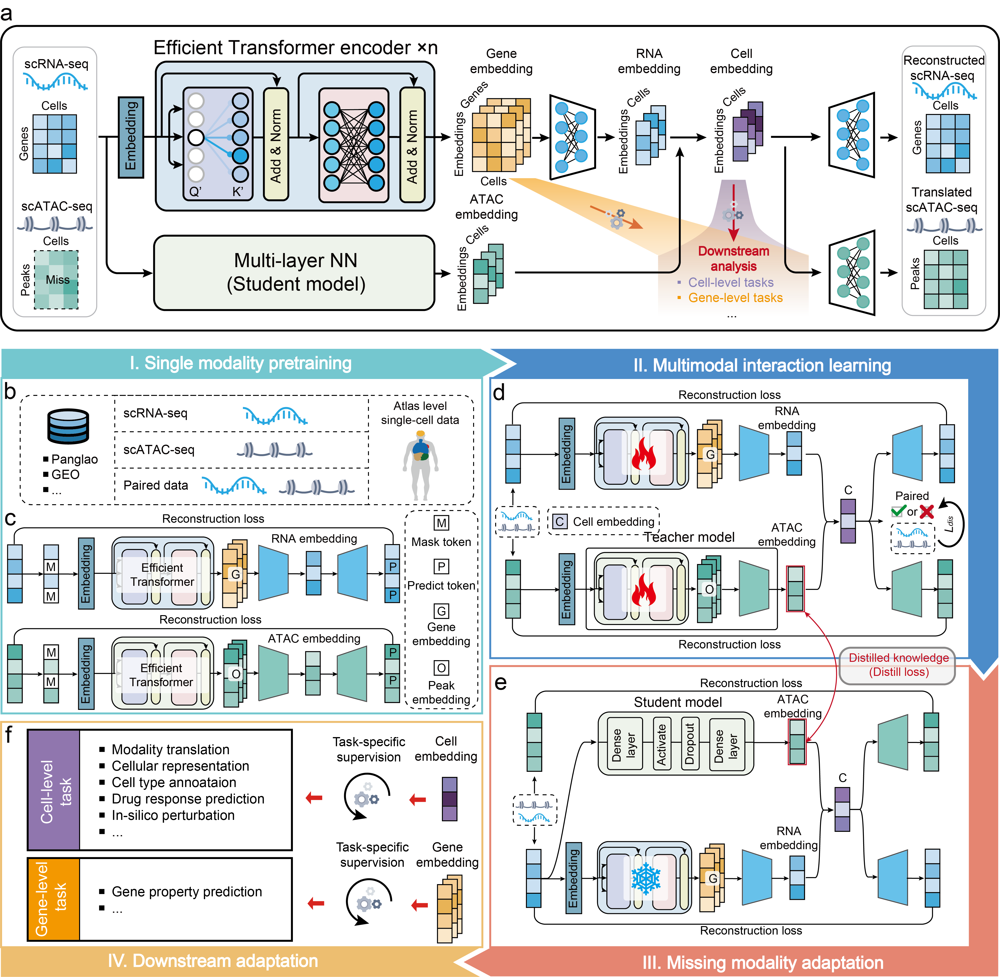

<div align="center">

# scMomer: A pretraining framework for inferring robust cellular representations from single-cell transcriptomes

[](https://www.python.org/downloads/release/python-390/)
[](https://pytorch.org/)
[](LICENSE)

</div>

scMomer learns multimodal-aware cell representations from scRNA-seq only input through a three-stage pretraining strategy: unimodal pretraining on large RNA and ATAC datasets, multimodal adaptation on paired data, and knowledge distillation to a student model that no longer requires ATAC at inference. This bridges abundant unimodal resources and scarce paired datasets, producing multimodal-aware representations from RNA-only input.

  <p align="center">
    
  </p>

---

## Table of contents

- [Installation](#installation)
- [Input data formats](#input-data-formats)
- [Quick start](#quick-start)
- [Training from scratch](#training-from-scratch)
- [License](#license)

---

## Installation

**Prerequisites:** Python 3.9, CUDA 12.4

```bash
git clone https://github.com/your-lab/scMomer.git
cd scMomer

conda create -n scmomer python=3.9 -y
conda activate scmomer

chmod +x setup.sh
./setup.sh
```

**Validation:**
```bash
python -c "import torch; print(f'PyTorch {torch.__version__}, CUDA: {torch.cuda.is_available()}')"
```

---

## Input data formats

| Format | Description | Usage |
|--------|-------------|-------|
| **h5mu** | MuData file with `rna` and `atac` modalities | `--data_path data.h5mu` |
| **h5ad** | AnnData file for RNA-only data | `--data_path data.h5ad` |

**RNA `.X`**: Raw or pre-processed count matrix (cells x genes).
**ATAC `.X`**: Raw integer counts (cells x peaks). Automatically binarized during training.

---

## Quick start

Pretrained model and example data are available at https://drive.google.com/drive/folders/1h8tRYHYKOYeOkBj2jKr5BYxJj2SPnr_w?usp=sharing.

### Data preprocessing

Raw data needs to be aligned to a shared gene space and normalized.

**RNA-only** (h5ad):

```bash
python data_process_rna.py \
    --ref reference/panglao_10000.h5ad \
    --query example_data/raw_rna.h5ad \
    --output example_data/processed_rna.h5ad \
    --min_genes 200 \
    --target_sum 1e4 \
    --log_base 2
```

**Multimodal** (h5mu):

```bash
python data_process_mulimodal.py \
    --input example_data/raw_multimodal.h5mu \
    --ref reference/panglao_10000.h5ad \
    --output example_data/processed_multimodal.h5mu
```

### Cell representation

```bash
python evaluate_embedding.py \
    --h5ad example_data/example_rna.h5ad \
    --checkpoint pretrained_models/scmomer_pretrained.pth \
    --label_col cell_type \
    --save_dir ./eval_output/ \
    --device 0
```

Saves `representations.h5ad` with 128-dim embeddings in `.obs`. Use for downstream analysis:

```python
import scanpy as sc

adata = sc.read_h5ad("eval_output/representations.h5ad")
sc.pp.neighbors(adata)
sc.tl.umap(adata)
sc.pl.umap(adata, color="cell_type")
```

### Cell type annotation

Train on labeled reference data:

```bash
python train_celltype.py \
    --h5ad example_data/example_rna.h5ad \
    --checkpoint pretrained_models/scmomer_pretrained.pth \
    --label_col cell_type \
    --outdir ./output_celltype/ \
    --device 0
```

Predict on query data:

```bash
python predict_celltype.py \
    --h5ad example_data/query_rna.h5ad \
    --checkpoint ./output_celltype/model.pt \
    --label_classes ./output_celltype/label_classes.npy \
    --device 0
```

### Cross-modal translation

Train RNA -> ATAC translation model:

```bash
python train_translation.py \
    --data_path example_data/example.h5mu \
    --checkpoint pretrained_models/scmomer_pretrained.pth \
    --outdir ./output_translation/ \
    --device 0
```

Evaluate:

```bash
python evaluate_translation.py \
    --data_path example_data/example_test.h5mu \
    --checkpoint ./output_translation/translation_model.pth \
    --device 0
```

### Drug response prediction

Train:

```bash
# classification (binary IC50, per-drug thresholds)
python train_drug.py --data_dir ./drug_data/ --classification --outdir ./output_drug/

# regression (continuous IC50)
python train_drug.py --data_dir ./drug_data/ --no-classification --outdir ./output_drug/
```

Evaluate:

```bash
python evaluate_drug.py --data_dir ./drug_data/ \
    --drug_checkpoint ./output_drug/drug_response_model.pth --classification
```

For custom downstream tasks, add a `sub_task` head to the model and fine-tune on your labeled data.

---

## Training from scratch

Three stages: unimodal pretraining (S1), multimodal pretraining (S2), knowledge distillation (S3). Each stage produces a checkpoint consumed by the next.

### Stage 1 — Unimodal pretraining

Pretrain RNA and ATAC encoders independently with masked autoencoding.

**RNA**:

```bash
# finetune from panglao pretrained (recommended)
torchrun --nproc_per_node=4 pretrain_rna.py \
    --data_path data/paired_multimodal.h5mu \
    --model_path pretrained_models/panglao_pretrain.pth \
    --batch_size 3 --epoch 100 --learning_rate 1e-4 --grad_acc 5 --mask_prob 0.15 \
    --ckpt_dir ./saved_model/ --model_name s1_rna

# or from scratch (omit --model_path)
torchrun --nproc_per_node=4 pretrain_rna.py \
    --data_path data/paired_multimodal.h5mu \
    --batch_size 3 --epoch 100 --learning_rate 1e-4 --grad_acc 5 --mask_prob 0.15 \
    --ckpt_dir ./saved_model/ --model_name s1_rna
```

**ATAC**:

```bash
torchrun --nproc_per_node=4 pretrain_atac.py \
    --data_path data/paired_multimodal.h5mu \
    --batch_size 32 --epoch 100 --learning_rate 1e-4 --grad_acc 5 --mask_prob 0.15 \
    --ckpt_dir ./saved_model/ --model_name s1_atac
```

### Stage 2 — Multimodal pretraining

Load S1 weights, jointly train RNA and ATAC encoders with cross-modal reconstruction and adversarial alignment.

```bash
torchrun --nproc_per_node=4 pretrain_multimodal.py \
    --data_path data/paired_multimodal.h5mu \
    --rna_model_path saved_model/s1_rna.pth \
    --atac_model_path saved_model/s1_atac.pth \
    --batch_size 3 --epoch 100 --lr 1e-4 --grad_acc 5 --projection_dim 128 \
    --ckpt_dir ./saved_model/ --model_name s2_multimodal
```

### Stage 3 — Student distillation

Train a student encoder (FFN) that maps RNA to the ATAC latent space, enabling RNA-only inference.

**A. Extract teacher embeddings:**

```bash
python get_latent.py \
    --data_path data/paired_multimodal.h5mu \
    --model_path saved_model/s2_multimodal.pth \
    --save_dir ./embeddings/
```

**B. Train student encoder (optional):**

If skipped, `pretrain_missing.py` will initialize the student randomly.

```bash
python train_distill_single.py \
    --data_path data/paired_multimodal.h5mu \
    --emb_dir ./embeddings/ \
    --ckpt_dir ./saved_model/ \
    --batch_size 256 --epoch 100 --lr 1e-4
```

**C. Pretrain missing modality:**

```bash
# with pre-trained student
torchrun --nproc_per_node=4 pretrain_missing.py \
    --data_path data/paired_multimodal.h5mu \
    --model_path saved_model/s2_multimodal.pth \
    --encoder_path saved_model/student_encoder.pth \
    --train_latent embeddings/train_embeddings.npy \
    --val_latent embeddings/val_embeddings.npy \
    --batch_size 3 --epoch 100 --lr 1e-4 --grad_acc 5 \
    --ckpt_dir ./saved_model/ --model_name pretrained_scmomer

# or without pre-trained student (omit --encoder_path)
torchrun --nproc_per_node=4 pretrain_missing.py \
    --data_path data/paired_multimodal.h5mu \
    --model_path saved_model/s2_multimodal.pth \
    --train_latent embeddings/train_embeddings.npy \
    --val_latent embeddings/val_embeddings.npy \
    --batch_size 3 --epoch 100 --lr 1e-4 --grad_acc 5 \
    --ckpt_dir ./saved_model/ --model_name pretrained_scmomer
```

Use `pretrained_scmomer.pth` for all downstream tasks described in [Quick start](#quick-start).

---

## License

GPL-3.0 — see [LICENSE](LICENSE).

## Contact

Any questions are welcome. Please contact me at: p2424393@mpu.edu.mo


